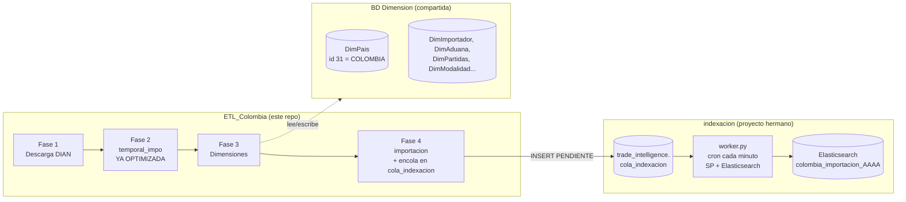

# Arquitectura — Trade Intelligence Data Warehouse Colombia

## 1. Visión general

Este proyecto (`ETL_Colombia`) construye un Data Warehouse de comercio
exterior colombiano (importaciones, y a futuro exportaciones) sobre MySQL 8,
y deja los datos listos para que **otro proyecto ya existente,
[TradeIntelligence](../../TradeIntelligence)**, los indexe en Elasticsearch y
los sirva a los usuarios finales (reportes, tableros, búsqueda).

No es un sistema aislado: es una pieza de una plataforma más grande, con dos
bases de datos MySQL compartidas entre TODOS los países del Data Warehouse
(no sólo Colombia) y un motor de metadata/indexación que ya vive en
TradeIntelligence. Entender esas dos piezas compartidas es la clave para
entender por qué este proyecto está diseñado como está.

## 2. Las dos bases de datos compartidas

### 2.1 `Dimension` (MySQL, mismo servidor)

Ya existía antes de este proyecto (la usa también un ETL de países de la
Unión Europea). Contiene dimensiones conformadas de Kimball reutilizables
entre países: `DimPais`, `DimAduana`, `DimPuerto`, `DimImportador`,
`DimExportador`, `DimAgenteAduanero`, `DimPartidas`, `DimUnidadMedida`,
`DimTransporte`, `DimMoneda`, `DimIncoterm`, `DimRegimen`,
`DimAcuerdoComercial`, `DimTiempo`, `DimRegion`.

Convención de esas tablas: `Id_DimX` autoincremental como PK, y las que
varían por país tienen `CodDimPais INT` con una `FOREIGN KEY` real hacia
`DimPais.Id_DimPais`. **`COLOMBIA = Id_DimPais 31`** (confirmado contra la
base real; no confundir con 169, que es Corea del Sur).

Este proyecto:
- **Reutiliza tal cual** (agregando filas con `CodDimPais=31` cuando hace
  falta): `DimPais`, `DimAduana`, `DimImportador`, `DimExportador`,
  `DimAgenteAduanero`, `DimPartidas`.
- **Agrega 13 dimensiones nuevas** (mismo patrón `Id_DimX`/`CodDimPais`+FK)
  para conceptos que Colombia introduce y no existían: `DimDepartamento`,
  `DimMunicipio`, `DimEmpresaTransportadora`, `DimBanco`, `DimFormaPago`,
  `DimTipoDeclaracion`, `DimClaseImportador`, `DimTipoImportacion`,
  `DimEmbalaje`, `DimEntidadIntermedia`, `DimDeposito`,
  `DimActividadEconomica`, `DimModalidad`.
- **NO usa** las tablas legacy `DimPartida`/`DimUnidad`: su columna `codpais`
  no corresponde a `DimPais.Id_DimPais` (los valores y las descripciones en
  inglés muestran que pertenecen al esquema propio de otro ETL de países de
  la UE); usarlas con `CodDimPais=31` habría arriesgado cruzar datos entre
  países.
- **NO escribe nombres de país nuevos en `DimPais`** (ver §4).

Ver el detalle completo, columna por columna, en
[Modelo_Dimensional.md](Modelo_Dimensional.md).

### 2.2 `trade_intelligence` (MySQL, mismo servidor)

Es la base de datos compartida por la plataforma de consumo. Contiene la
tabla `cola_indexacion` (ver §3), que es el **único** punto de contacto de
este proyecto con esa base: `04_ETL_Importaciones.py` hace un `INSERT`
directo en SQL plano, sin Django ni ORM, cuando termina de cargar un
archivo. `trade_intelligence` también tiene la tabla legacy
`trade_data_campoelastic` (metadata de columnas para la UI de búsqueda de
TradeIntelligence), pero **este proyecto ya no la toca en absoluto** — ver
§3.

## 3. Contrato de integración con `indexacion`

Este proyecto **nunca** escribe en Elasticsearch, ni ejecuta código de otro
proyecto en subproceso: solo encola. El contrato completo es una fila en
`trade_intelligence.cola_indexacion` (`common/cola_indexacion.py`, insertada
por `04_ETL_Importaciones.py` al terminar cada archivo):

| Columna | Valor que pone este proyecto |
|---|---|
| `pais` | `"colombia"` |
| `tipo_intercambio` | `"IMPORTACION"` / `"EXPORTACION"` |
| `procedimiento_almacenado` | Nombre del SP de MySQL que, dado un `archivo`, devuelve las filas ya planas listas para indexar (`sp_extraer_importacion_por_archivo`, definido en `01_SQL/06_Procedimientos.sql`) |
| `archivo` | Nombre del archivo origen procesado |
| `estado` | `"PENDIENTE"` |

El proyecto hermano `indexacion` trae un `worker.py` (script de consola, sin
Django, corrido por cron cada minuto) que toma las filas `PENDIENTE`,
ejecuta el SP indicado pasándole `archivo`, y sube el resultado a
Elasticsearch con la Bulk API — ver `indexacion/README.md` y
`indexacion/worker.py`. Este worker **no depende de `CampoElastic`**: el SP
es la única fuente de verdad de qué columnas se indexan (reemplazó al diseño
anterior de escaneo de `INFORMATION_SCHEMA` + mapping dinámico desde
`CampoElastic`, que quedó retirado).

### Por qué la resolución de dimensiones se hace en Python (y no con SQL JOIN)

El diseño original de este documento contemplaba una `VW_Elastic_Importaciones`
con ~20 `JOIN`. Se descartó por dos razones, ambas confirmadas después:

1. Las reglas obligatorias del proyecto prohíben expresamente "hacer JOIN
   repetitivos durante el ETL" y piden resolver dimensiones con diccionarios
   de Python cargados una única vez.
2. Con las dimensiones viviendo en `Dimension` (fuera de `colombia`), un JOIN
   de este tipo sería además *cross-database*, algo que ninguna herramienta
   de este proyecto necesita en caliente.

Por eso `04_ETL_Importaciones.py` resuelve cada valor **en memoria** contra
diccionarios cargados desde `Dimension` y escribe directamente la fila ya
plana en `importacion`. La vista `VW_Elastic_Importaciones` que sí existe
(`01_SQL/05_Vistas.sql`) es sólo un alias de nombre estable sobre
`importacion`, no agrega ningún JOIN.

### Automatización sin duplicar el indexador

Este proyecto **no reimplementa** metadata/mapping/indexación: encola cada
archivo procesado (`cola_indexacion`, §3) y deja que el worker de
`indexacion` lo indexe de forma asíncrona, sin esperarlo ni dispararlo
directamente. Esto evita que dos copias de la misma lógica de indexación
diverjan con el tiempo, y hace innecesario cualquier `manage.py` o
intérprete Python de otro proyecto configurado en `.env`.

## 4. Decisión: `DimPais` no se toca desde este ETL

`DimPais` ya tiene 524 filas compartidas por todos los países. Se intentó en
un primer momento insertar automáticamente cualquier nombre de país "nuevo"
detectado en `temporal_impo` — y falló: la DIAN usa nombres oficiales largos
("COREA (SUR) REPÚBLICA DE", "ESTADOS UNIDOS DE AMÉRICA",
"IRÁN REPÚBLICA ISLAMICA DEL") que no coinciden textualmente con los nombres
ya cargados para otros países, y el primer intento insertó ~64 filas
duplicadas (países reales bajo un segundo nombre, y varias "ZONA FRANCA..."
que ni siquiera son países) en una tabla **compartida**.

La solución: `common/geo.py` trae un catálogo estático propio
(nombre-en-español-de-la-DIAN → ISO2, con alias para las variantes largas),
resuelto 100% en Python. `importacion.pais_origen` (el campo que usa el mapa
mundial de TradeIntelligence) sale de ahí, nunca de un JOIN/INSERT contra
`Dimension.DimPais`. Cobertura verificada contra datos reales: 99.2% de las
filas de un archivo real quedaron con ISO2 resuelto; el resto son "ZONA
FRANCA..." (correctamente sin país, no es un dato faltante).

## 5. Por qué "un archivo a la vez" (y no por fases completas)

Pedido explícito: procesar un archivo y "liberarlo" (encolado para indexar)
antes de seguir con el siguiente — en vez de terminar TODA la Fase 3 para el
histórico completo, luego TODA la Fase 4, etc. `main.py::run_dw_pipeline()`
implementa esto: por cada `archivo_origen` pendiente (según
`etl_control_carga`) corre Fase 3 → Fase 4 para ESE archivo antes de pasar al
siguiente; Fase 4 encola el archivo en `cola_indexacion` (§3) al terminar,
así el worker de `indexacion` puede empezar a indexarlo sin que este ETL
tenga que esperarlo.

## 6. Por qué `importacion` no está particionada en MySQL

Se consideró particionar `importacion` por `RANGE(anio)` (como hacen muchos
Data Warehouses a esta escala). Se descartó tras confirmar dos cosas: (a)
Elasticsearch **ya particiona por año a nivel de índice**
(`colombia_importacion_2018`, `..._2019`, ...), que es donde ocurre el
análisis real; y (b) particionar en MySQL exige que la columna de partición
(`anio`) forme parte de la PRIMARY KEY, degradándola de `id` simple a
compuesta `(id, anio)` — el SP de indexación (§3) usa la columna `id` del
resultado tal cual como `_id` de Elasticsearch, así que una PK compuesta
complicaría ese contrato sin necesidad. El beneficio de particionar en MySQL
era además marginal, porque nadie consulta `importacion` con SQL filtrado
por año — el filtro por año lo resuelve Elasticsearch. Se optó por PK simple
(`id`) sin particionar, verificado en vivo: el `_id` de Elasticsearch
coincide exactamente con `importacion.id`.

## 7. Historial de decisiones (por qué el diseño cambió a mitad de camino)

1. **Primer diseño** (abandonado): dimensiones propias dentro de `colombia`
   (`DimPais`, `DimImportador`, ... 22 tablas), tabla de hechos normalizada
   `Importaciones` + vista `VW_Elastic_Importaciones` con ~20 JOIN +
   procedimiento `PA_Elastic_Importaciones` materializando `importacion`.
   Técnicamente correcto en aislamiento, pero:
   - Duplicaba dimensiones que ya existían en `Dimension`, compartidas con
     otros países.
   - Violaba la regla de "nunca JOIN durante el ETL" al resolver todo en SQL
     en vez de en Python.
2. **Corrección** (este diseño): dimensiones en `Dimension` (reusando lo que
   ya existe, agregando sólo lo que falta), resolución en Python, `colombia`
   con únicamente `temporal_impo` + `importacion` + tablas de control.
3. Durante la implementación se corrigieron además, contra datos reales:
   - El id de Colombia (31, no 169).
   - Las tablas de partida/unidad de medida a usar (nuevas con FK, no las
     legacy con `codpais` ajeno).
   - `DimExportador` (el campo NIT del exportador extranjero viene vacío en
     el 100% de los casos reales; se usa el nombre normalizado como respaldo
     de clave natural).
   - `DimModalidad` (clave compuesta de dos columnas, no una sola).
   - Un `tipo_elastic` incorrecto pre-existente en `trade_data_campoelastic`
     (`manifiesto_de_carga` como `double` debiendo ser `keyword`), detectado
     y corregido en su momento vía un script de metadata hoy retirado (el
     diseño de metadata cambió después, ver §3).
   - La estrategia de país (ver §4).
   - PK simple sin particionar en `importacion` (ver §6).

## 8. Qué NO hace este proyecto (alcance explícito)

- No modifica la Fase 2 (`02_ETL_SQL.py`, antes `02_fase_sql.py`): sigue
  siendo un "dumb pipe" de streaming hacia `temporal_impo`.
- No reimplementa metadata, mapping de Elasticsearch, ni el indexador: solo
  encola cada archivo en `cola_indexacion` (§3) y delega el resto al worker
  de `indexacion`.
- No pretende resolver automáticamente todo enriquecimiento de nombre
  faltante (bancos, entidades intermedias, depósitos): quedan expuestos por
  su código crudo hasta que alguien complete `Nombre` en la dimensión
  correspondiente — la próxima corrida del ETL automáticamente empezará a
  mostrar el nombre en cuanto se complete, sin ningún cambio de código.
