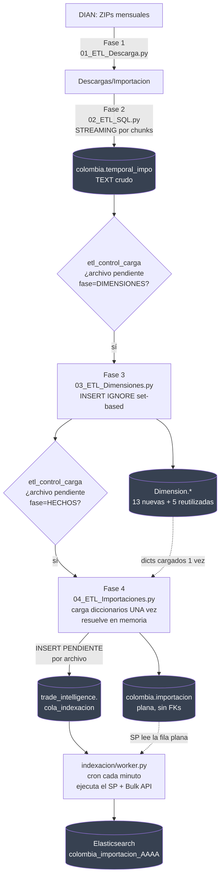
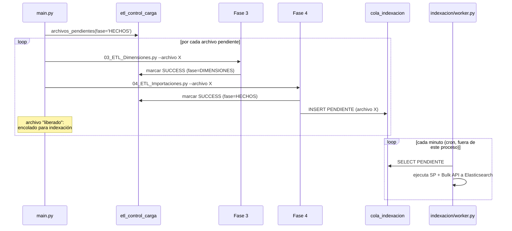

# Flujo ETL — de cero a Elasticsearch

## Diagrama completo

## Orquestación "por archivo" (`main.py`)

Por qué así: procesar TODO el histórico antes de encolar el primer archivo
significaría esperar horas antes de que la indexación pudiera empezar.
Procesando archivo por archivo, cada mes queda encolado (y disponible en
Elasticsearch en cuanto el worker lo procesa) apenas termina su propio
ciclo, y un archivo con error no bloquea a los demás (ver más abajo).

## Idempotencia y reanudación

Cada fase dependiente de un archivo (`DIMENSIONES`, `HECHOS`) tiene su propio
renglón en `etl_control_carga` con `estado` (`PENDIENTE`/`EN_PROCESO`/
`SUCCESS`/`ERROR`). Reanudar un proceso interrumpido (o simplemente correr el
ETL de nuevo) es siempre la misma operación: pedir los archivos que
**todavía no tengan `SUCCESS`** para esa fase (`common/checkpoint.py::
archivos_pendientes`). No hace falta recordar dónde quedó manualmente.

- **Fase 3** puebla `Dimension.*` con `INSERT IGNORE` sobre la `UNIQUE KEY`
  de cada dimensión: repetir el mismo archivo nunca duplica una fila.
- **Fase 4** borra por `archivo_origen` antes de reinsertar
  (`DELETE FROM importacion WHERE archivo_origen = X`), el mismo patrón que
  ya usa la Fase 2 sobre `temporal_impo`, y luego encola una tarea nueva en
  `cola_indexacion` para ese archivo (ver §3 de Arquitectura.md).

Si un archivo falla a mitad de camino, su fila en `etl_control_carga` queda
en `ERROR` (con el mensaje) y **no** bloquea a los siguientes archivos del
lote — se reintenta solo, en la próxima corrida, sin intervención manual
más que resolver la causa del error.

## Reiniciar un proceso interrumpido

No hay nada que "reiniciar" manualmente: basta con volver a ejecutar
`python main.py --dw-only` (o el ciclo completo `python main.py`). Todo lo ya
exitoso se salta automáticamente (vía `etl_control_carga`); sólo se
reprocesa lo pendiente o lo que quedó en `ERROR`.

## Cómo agregar un nuevo país

1. Crear su base de datos MySQL (ej. `mexico`), con su propia
   `temporal_impo`/`temporal_expo` (Fase 1-2, iguales a las de Colombia,
   ajustando sólo las URLs/rutas de descarga).
2. Confirmar/crear su fila en `Dimension.DimPais` (o usar la que ya exista)
   y usar ese `Id_DimPais` en vez de `31` en las Fases 3-4 (hoy está
   fijo como constante `COD_DIM_PAIS`; para más de un país activo a la vez
   convendría moverlo a una variable de entorno o argumento de línea de
   comandos — ver "Buenas prácticas" en el [README](README.md)).
3. Revisar si las dimensiones nuevas de este proyecto
   (`DimDepartamento`, `DimModalidad`, etc.) también le sirven a ese país o
   si necesita las suyas propias con nombres de columna distintos.
4. Dar de alta el SP de extracción de ese país/tipo en
   `01_SQL/06_Procedimientos.sql` y registrar el `procedimiento_almacenado`
   correspondiente al encolar (ver `common/cola_indexacion.py` y
   Arquitectura.md §3) para que el worker de `indexacion` sepa cómo indexar
   sus archivos.

## Cómo agregar una nueva dimensión

1. Verificar primero si el concepto ya existe en `Dimension` (evitar
   duplicar).
2. Si es nueva: agregar el `CREATE TABLE` en `01_SQL/01_Dimensiones.sql`
   siguiendo el patrón `Id_DimX` + `CodDimPais` + `FOREIGN KEY` (a menos que
   sea un catálogo verdaderamente universal, como `DimTiempo`).
3. Agregar la regla de población (`INSERT IGNORE ... SELECT DISTINCT`) a
   `REGLAS` en `02_Python/03_ETL_Dimensiones.py`.
4. Agregar la resolución (`_resolver(...)`) y la columna de salida en
   `02_Python/04_ETL_Importaciones.py` (`COLUMNAS_DESTINO` +
   `transformar_fila`) y en `01_SQL/04_Importaciones.sql` (columna de
   `importacion`).
5. Actualizar el SP de extracción (`01_SQL/06_Procedimientos.sql`) para que
   incluya la columna nueva en su `SELECT` — el worker de `indexacion` la
   indexa automáticamente en cuanto el SP la devuelve, sin ningún paso
   manual adicional desde este proyecto.

## Cómo agregar una nueva columna (sin ser una dimensión nueva)

Si es una medida o un documento: agregarla a `COLUMNAS_ORIGEN`/
`COLUMNAS_DESTINO` en `04_ETL_Importaciones.py`, a la tabla `importacion`
(`01_SQL/04_Importaciones.sql`) y al `SELECT` del SP en
`01_SQL/06_Procedimientos.sql` — no hace falta ningún paso manual de
metadata aparte.

## Cómo agregar nuevos filtros

Los filtros de búsqueda los administra TradeIntelligence (`CampoElastic.
filtro`), no este proyecto: basta con activar el flag `filtro=True` en el
admin de TradeIntelligence para la columna deseada — no requiere tocar
`ETL_Colombia`.

## Mantenimiento periódico

- Nada que archivar/particionar en MySQL (ver Arquitectura.md §6): si se
  necesita partición por año a nivel de índice, es responsabilidad del
  worker de `indexacion` (fuera de este proyecto), no de este ETL.
- Revisar mensualmente los `WARNING` de Fase 3/4 en los logs
  (`dian_dw_*.log`) por columnas de deriva nuevas que la DIAN pueda
  introducir en archivos futuros.
