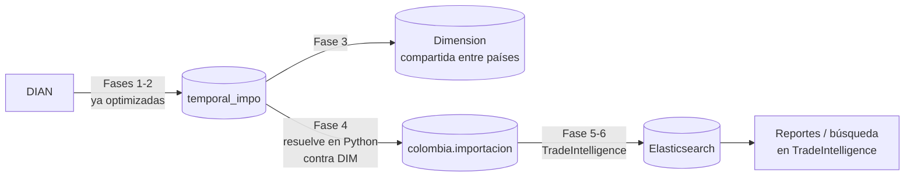

# Trade Intelligence — Data Warehouse Comercio Exterior Colombia

## Introducción

Este documento explica, de punta a punta, cómo las estadísticas mensuales
de importaciones de la DIAN (archivos ZIP con miles de declaraciones)
terminan convertidas en un Data Warehouse dimensional en MySQL y disponibles
para búsqueda/reportes en Elasticsearch a través de la plataforma
**TradeIntelligence**. No asume que quien lo lee conoce el proyecto de
antemano.

No hace falta leer todo de corrido: cada sección remite a un documento más
detallado.

## Objetivos

- Construir un Data Warehouse de comercio exterior capaz de escalar a
  cientos de millones de registros, con procesamiento incremental,
  idempotente y reanudable.
- Detectar automáticamente qué columnas del origen son dimensiones, cuáles
  son medidas, cuáles son documentos y cuáles son sólo auditoría — sin
  definir manualmente el modelo dimensional.
- Dejar los datos listos para Elasticsearch sin que Elasticsearch lea nunca
  directamente las tablas de staging.
- Integrarse con la plataforma ya existente (TradeIntelligence) en vez de
  duplicar su metadata, su mapping o su indexador.

## Mapa de la documentación

| Documento | Qué explica |
|---|---|
| [Arquitectura.md](Arquitectura.md) | La arquitectura completa, las dos bases de datos compartidas (`Dimension`, `trade_intelligence`), el contrato de integración con TradeIntelligence, y el historial de decisiones (qué cambió a mitad de camino y por qué). **Empezar por aquí.** |
| [Modelo_Dimensional.md](Modelo_Dimensional.md) | Cómo se detectó automáticamente cada dimensión (cardinalidad real medida contra la base), deriva de esquema entre vigencias de archivo, y notas de calidad de datos encontradas en producción. |
| [Flujo_ETL.md](Flujo_ETL.md) | El pipeline completo Fase 1 → 6, la orquestación "un archivo a la vez", idempotencia/reanudación, y cómo extender el proyecto (nuevo país, nueva dimensión, nueva columna). |
| [Elastic.md](Elastic.md) | Mapping, nombres de índice, indexación incremental, qué se indexa y qué no. |
| [Metadata.md](Metadata.md) | Cómo se generan los labels automáticamente, y las correcciones que se le aplicaron a la metadata en vivo. |

## Arquitectura en una imagen



Ver el diagrama completo (con las 7 fases y la orquestación por archivo) en
[Flujo_ETL.md](Flujo_ETL.md).

## Qué hace cada fase (resumen; detalle en Arquitectura.md/Flujo_ETL.md)

1. **Descarga** (`02_Python/01_ETL_Descarga.py`, antes `01_fase_descarga.py`
   en la raíz): descarga los ZIP mensuales de la DIAN. Sin cambios de lógica
   respecto al proyecto original, sólo se movió de carpeta.
2. **Staging** (`02_Python/02_ETL_SQL.py`, antes `02_fase_sql.py`): carga los
   ZIP por streaming/chunks hacia `temporal_impo` (todo TEXT, sin
   transformar). **No se modificó**, como pedían las reglas del proyecto.
3. **Dimensiones** (`02_Python/03_ETL_Dimensiones.py`): puebla, por archivo
   pendiente, las dimensiones en la base de datos compartida `Dimension`.
4. **Hechos** (`02_Python/04_ETL_Importaciones.py`): resuelve cada valor en
   memoria (diccionarios cargados desde `Dimension`) e inserta
   directamente, ya plano, en `colombia.importacion`.
5. **Metadata** (`02_Python/05_ETL_Metadata.py`): dispara la sincronización
   de metadata ya existente en TradeIntelligence y aplica labels/tipo
   mejorados.
6. **Elasticsearch** (`02_Python/06_ETL_Elastic.py`): dispara la indexación
   incremental ya existente en TradeIntelligence (sólo lo nuevo desde el
   último checkpoint).

`main.py` orquesta todo: por defecto, procesa **un archivo a la vez** de
punta a punta (dimensiones → hechos → índice) antes de pasar al siguiente,
para que cada mes quede disponible en Elasticsearch apenas termina, sin
esperar a que se procese todo el histórico.

## Cómo se detectaron las dimensiones automáticamente

Se perfiló la cardinalidad real de cada columna de `temporal_impo` (sobre
una muestra de 300.000 filas y también contra la base completa) para decidir
qué se convierte en dimensión, qué queda como medida, qué es un "documento"
(dimensión degenerada, se deja suelta en el hecho) y qué es sólo auditoría.
El detalle completo, columna por columna, con los números reales medidos,
está en [Modelo_Dimensional.md](Modelo_Dimensional.md).

## Cómo se resuelven los IDs / cómo funcionan los diccionarios Python

Nunca hay un `SELECT` por fila. `04_ETL_Importaciones.py` carga, una única
vez por archivo procesado, un diccionario Python por dimensión (`{código:
nombre}`) desde `Dimension`, y resuelve cada fila de `temporal_impo` contra
esos diccionarios en memoria antes de insertarla en `importacion`. Nunca hay
tablas MAP físicas ni tablas de relación: la resolución vive enteramente en
el código Python (`_resolver()` en `04_ETL_Importaciones.py`).

## Cómo funciona el procesamiento por chunks

Tanto la Fase 4 como el patrón de la Fase 2 leen `temporal_impo` con
`cursor.fetchmany(N)` (nunca `fetchall()`), transforman el bloque en memoria
y lo insertan con `executemany()` antes de pedir el siguiente bloque. La
tabla completa nunca se carga en memoria, sin importar cuántos cientos de
millones de filas tenga.

## Cómo funciona la carga incremental / cómo evitar duplicados / cómo reiniciar un proceso interrumpido

Ver [Flujo_ETL.md](Flujo_ETL.md) — sección "Idempotencia y reanudación". En
una frase: cada fase (por archivo, o por rango de `id` en el caso de
Elasticsearch) registra su propio checkpoint en MySQL
(`etl_control_carga`/`etl_checkpoint`), y "reanudar" es siempre la misma
operación (pedir lo que todavía no tenga éxito registrado), sin estado en
archivos locales ni intervención manual.

## Cómo agregar un país / una dimensión / una columna / un filtro

Ver [Flujo_ETL.md](Flujo_ETL.md), sección final, con los pasos concretos
para cada caso.

## Buenas prácticas y patrones utilizados

- **Kimball clásico**: dimensiones conformadas y compartidas
  (`Dimension`), dimensión de rol (`DimPais` en 5 roles), dimensiones
  degeneradas (números de documento sueltos en el hecho), smart key de
  tiempo (donde aplica).
- **"Reuse, don't duplicate"**: toda la Fase 5-7 se apoya en TradeIntelligence
  en vez de reimplementar metadata/mapping/indexación en paralelo (ver
  Arquitectura.md §3).
- **Nunca confiar en el nombre de columna sin verificar el dato real**: cada
  decisión de este documento (el id de Colombia, qué tabla de partida usar,
  el NIT vacío del exportador, la clave compuesta de modalidad, un
  `tipo_elastic` incorrecto en producción) se verificó contra la base de
  datos real antes de tomarla, no se asumió por el nombre de la columna.
- **Fail-soft, nunca fail-hard por un dato sucio**: `common/parsing.py`
  jamás lanza una excepción por un valor corrupto; lo resuelve a `NULL` y
  sigue con la fila siguiente.
- **Idempotencia por diseño, no por accidente**: `INSERT IGNORE` sobre
  claves naturales para dimensiones, `DELETE + INSERT` por archivo para
  hechos, checkpoint por `id` para indexación — los tres patrones ya
  utilizados en el proyecto original (Fase 2) se extendieron consistentemente
  a las fases nuevas.

## Estructura del proyecto

```
01_SQL/                  DDL y backfill de referencia (Dimension + colombia)
02_Python/
  01_ETL_Descarga.py      Fase 1 (antes 01_fase_descarga.py)
  02_ETL_SQL.py           Fase 2 (antes 02_fase_sql.py, SIN modificar)
  03_ETL_Dimensiones.py   Fase 3
  04_ETL_Importaciones.py Fase 4
  05_ETL_Metadata.py      Fase 5
  06_ETL_Elastic.py       Fase 6
  database.py             SQLite de control de descargas (Fase 1)
  common/                 Módulos compartidos (config, db, checkpoint, labels, geo, parsing)
03_Elastic/               Snapshots de referencia (mapping/índices reales; no autoritativos)
04_Documentacion/         Este documento y los demás
main.py                   Orquestador (loop por archivo)
```
